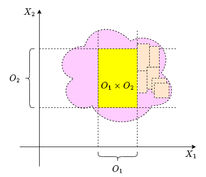

# 積位相と開基、準開基について

## 概要

何となくぼんやりと眺めると「あぁ、こんな感じでしょ・・・ん？」となる積位相と開基、準開基について見てみたい。この組み合わせは教育的な気がする。

※ なお、以下イメージ重視で書き方はゆるいので、100% 厳密な定義や記号とは言えない部分がある。

## 本文

添え字集合を$\Lambda$として、位相空間の族$(X_\lambda, \mathcal{O}_\lambda)_{\lambda \in \Lambda}$がある時に直積集合$X = \prod_{\lambda \in \Lambda} X_\lambda$に位相を入れたい。特に名前的に“積位相”と呼べるものを入れたい。

簡単のため$X = X_1 \times X_2$から始めたい。手始めに以下のような図を考えよう。

まず安直に「開集合$O_1 \in \mathcal{O}_1$と$O_2 \in \mathcal{O}_2$をとって、積集合$O_1 \times O_2$を$X$の開集合としたら良いのではないか？」と思うが、ピンクの吹き出しのようなものだって$X$の開集合だろうから、$O_1 \times O_2$だけではすべての開集合を網羅できていなさそうな気がする。

ところで、こういった矩形をひたすらピンクの吹き出しの中に敷き詰めていけば何とかなりそうな気もする。吹き出しの右隅のほうで詰めてみた。

そこで次のような概念に至る。記号類は大体文献 [U] に合わせている。

**定義** (開基; open base)

$(X, \mathscr{O})$を位相空間とする。$\mathscr{O}$の部分集合$\mathscr{P}$について、任意の$O \in \mathscr{O}$に対して、ある$\mathscr{P}_o \subset \mathscr{P}$がとれて、$O = \cup \mathscr{P}_o$とできる時、$\mathscr{P}$を位相$\mathscr{O}$の開基と呼ぶ。

$\mathscr{P}$は上の図では境界のない矩形、例えば黄色い矩形ということになる。

ということで、有限個の$X_i$からなる積集合$X= \prod_{i=1}^N X_i$の積位相 (と呼べるもの) は開基の作り方が分かるので何とかなりそうだが、無限個になると少々違ってくる。このやり方を無限のケースにまでスケールしたものは文献 [U]によると、「箱型積位相; [Box topology](https://en.wikipedia.org/wiki/Box_topology)」というものになるらしい。本来求めたい積位相よりは**強い** (細かい) ものになっている。有限個のケースでは箱型積位相も積位相も一致するので、今の時点ではピンと来ないものである[^1]。

[^1]: 有界閉集合とコンパクト集合の違いが分からない気持ちと似ているかもしれない。

### 積位相としてどういうものを考えたいか？

大体数学の定義というのは、何かしら望ましい性質というものがあって、それを満たすような最低限の枠組みを用意することが好まれるように思う。それに倣うように積位相もまた「○○であるような**最弱**の位相」という形をとる。

ここから添え字集合を$\Lambda$は**無限集合**とする。

どの本でもそうなので、唐突に以下のようなことを考える。

各$\lambda \in \Lambda$について射影

$$
\pi_\lambda: \prod_{\mu \in \Lambda} X_\mu \to X_\lambda
$$

を$X \ni (\ldots, x_\lambda, \ldots) \mapsto x_\lambda \in X_\lambda$で定めたい。$\Lambda$に全順序性は仮定していないのでこの書き方は良くはないが、お気持ち表明はできると思う。

そこで、「すべての射影$\pi_\lambda$が連続であるような**最弱**の位相」として積位相を導入したい。

連続性の定義は、開集合の写像による逆像が開集合であることであった。つまり、$X$の積位相と呼べる位相$\mathcal{O}_X$が確立されたとすれば、各$\lambda \in \Lambda$について、任意の$O_\lambda \in \mathcal{O}_\lambda$に対して$\pi_\lambda^{-1}(O_\lambda) \in \mathcal{O}_X$となってくれれば良い。

そんな$\mathcal{O}_X$とは一体？という疑問が湧くが、これまた数学の定義はずるいので、「$\pi_\lambda^{-1}(O_\lambda)$らが生成する位相を$\mathcal{O}_X$とする」ということになる。では「$\pi_\lambda^{-1}(O_\lambda)$らを開基としましょう」とするとちょっとまずいことが起こる。

以下のように“円筒形” (シリンダー状)[^2] になって長すぎるのである。これだと$X_\lambda$が有限個の場合とも噛み合わない。

[^2]: $O_\lambda$の部分として円形でも想像すれば良い。

では$X_\lambda$が有限個の場合のように「円筒形の共通部分$\bigcap_{\lambda \in \Lambda} \pi_\lambda^{-1}(O_\lambda)$を開基として使えば良いのでは？」となるが、これだと上で述べた箱型積位相に至ってしまう。

お気持ち駆動で描いた絵だと以下のようになるであろうか？

シリンダーだと大きすぎるし、箱だと小さすぎるので間をとって、「円筒形の有限個の共通部分$\bigcap_{\lambda: \text{finite}} \pi_\lambda^{-1}(O_\lambda)$を開基として使えば良いのでは？」という案が出て来る。実はこれが求めたかった積位相に繋がるものである。

ここで、準開基の概念を持ってこよう。

**定義** (準開基; subbase)

$(X, \mathscr{O})$を位相空間とする。$\mathscr{O}$の部分集合$\mathscr{S}$について、任意の$O \in \mathscr{O}$と$x \in O$に対して、常に有限個の$N_1, \cdots, N_r \in \mathscr{S}$がとれて、$x \in \cap_i N_i \subset O$とできる時、$\mathscr{S}$を位相$\mathscr{O}$の準開基と呼ぶ。

要は、

- $\{ \pi_\lambda^{-1}(O_\lambda) \}$を準開基として、
- $\{ \bigcap_{\lambda: \text{finite}} \pi_\lambda^{-1}(O_\lambda) \}$を開基として、
- $\{ \bigcup \left(\bigcap_{\lambda: \text{finite}} \pi_\lambda^{-1}(O_\lambda)\right) \}$を開集合とする

ような位相が、$X= \prod_{i=1}^N X_i$の積位相だということである。この時すべての$\pi_\lambda$は連続になっているし、この定義は$X_\lambda$が有限個の場合の直感的な積集合とも一致している。

### 積位相の旨味

「で？この積位相は何が美味しいの？」という部分については、例えば以下の定理が該当するのだろう。

**Tychonoffの定理**

$(X_\lambda, \mathcal{O_\lambda})_{\lambda \in \Lambda}$を位相空間の (一般には無限個の) 族とし、$(\prod_{\lambda \in \Lambda} X_\lambda, \mathcal{O}_X)$を積位相を持った積空間とする。この時すべての$(X_\lambda, \mathcal{O_\lambda})$がコンパクト空間であれば$(\prod_{\lambda \in \Lambda} X_\lambda, \mathcal{O}_X)$もコンパクト空間である。

### 箱型積位相の欠点

一方、「箱型積位相; [Box topology](https://en.wikipedia.org/wiki/Box_topology)」の場合、一般にはTychonoffの定理の主張は成立しない。

リンク先の Wikipedia によると$X_i = \{0, 1\}$として離散位相 (すべての部分集合を開集合とする位相) が入っているものが反例となる。$X_i$の部分集合全体は$\mathcal{O} = \{ \empty,\{0\}, \{1\}, \{0,1\} \}$でありこれらはすべて開集合である。$X_i$の任意の部分集合$C$の開被覆はこれらの組み合わせであるが、これらは選別するまでもなく有限個であることから$X_i$はコンパクト空間である。しかし、$X = \prod_{i=1}^\infty X_i$を考えると、$X$自身の開被覆の部分被覆で$X$を覆うとするとすべての$i \in \N$から被覆を選ばざるを得ないので、$X$はコンパクト空間にはならない。

### 積位相の旨味再び

では、何故、積集合だとコンパクトになるのかと言うと、乱暴なイメージではあるが、準開基の定義を思い出すと、

$$
\begin{align*}
\{1\} \times \{0\} \times \{0,1\} \times \{0,1\} \times \{0,1\} \times \cdots
\end{align*}
$$

や

$$
\begin{align*}
\{0,1\} \times\{0\} \times \{0\} \times \{0,1\} \times \{0,1\} \times \cdots
\end{align*}
$$

のようなシリンダーが準開基なので、単一の準開基が無限個のコンポーネント$X_i$を最初から被覆しているのである。これらの有限個の共通部分である開基もまた無限個のコンポーネント$X_i$を被覆しており、それらの任意個の合併である開集合も無限個のコンポーネント$X_i$を被覆していることが分かる。

つまり、$X$の任意の集合$C$の開被覆は個々の被覆がとんでもなく大きなものなので、高々有限個を選ぶだけで$C$くらい覆えてしまうということである。よって、$X$は積位相でコンパクト空間となる。

## まとめ

積空間への積位相の導入を通じて、流れに乗って開基を炙り出し、次いで準開基を炙り出した。わりと自然に導入できる気がする。

また、Tychonoffの定理を通じて、積位相の持つ強力な性質、そして積位相になりきれない箱型積位相の欠点についても駆け足で見た。

## 参考文献

[U] 内田伏一, 集合と位相, 裳華房, 1986
[K] John L. Kelley, General Topology, Ishi Press, 1955
